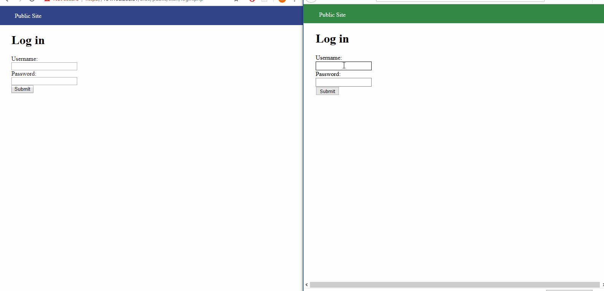
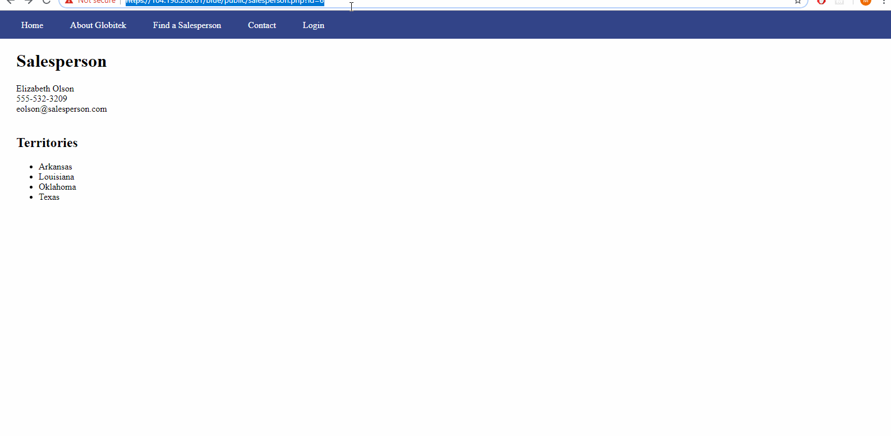
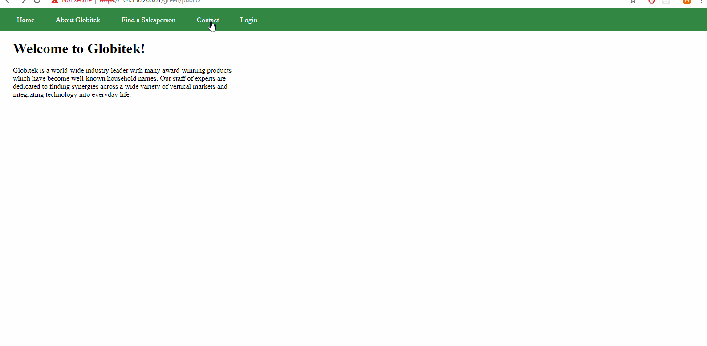
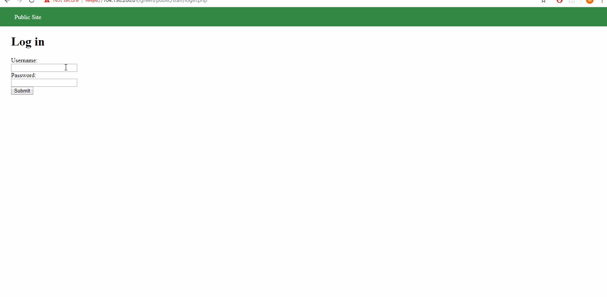
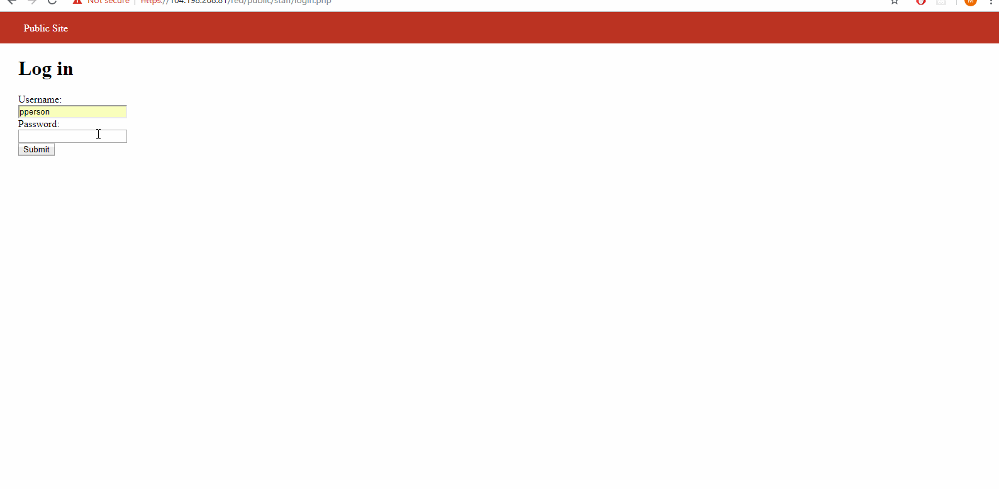
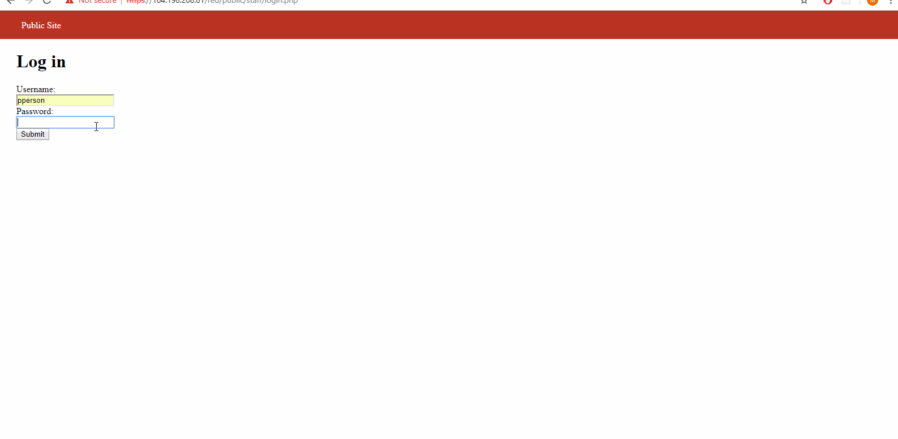

# Project 8 - Pentesting Live Targets

Time spent: **5** hours spent in total

> Objective: Identify vulnerabilities in three different versions of the Globitek website: blue, green, and red.

The six possible exploits are:
* Username Enumeration
* Insecure Direct Object Reference (IDOR)
* SQL Injection (SQLi)
* Cross-Site Scripting (XSS)
* Cross-Site Request Forgery (CSRF)
* Session Hijacking/Fixation

Each version of the site has been given two of the six vulnerabilities. (In other words, all six of the exploits should be assignable to one of the sites.)

## Blue

Vulnerability #1: Session Hijacking/Fixation

    GIF: 
  - Details
    * Open two browsers (Chrome and Firefox in this case).
    * Login to green and go to https://104.198.208.81/green/public/hacktools/change_session_id.php and copy the PHPSESSIONID.
    * Copy and paste that in to Blue https://104.198.208.81/blue/public/hacktools/change_session_id.php and press "Change".
    * Change the url to https://104.198.208.81/blue/public/index.php and you will be logged in without even logging in!

Vulnerability #2: SQL Injection
  GIF: 
  - Details
    * Direct to the "Find a Sales Person Tab"
    * Click on a sales person and add this ' OR SLEEP(5)=0--' to the url at the end. 

## Green

Vulnerability #1: Cross-Site Scripting (XSS)
  GIF: 
   - Details
       * Click on "Contact Tab", fill out the forms and add this  to the comment box.
       * Log in and you'll get an XSS alert.
        
Vulnerability #2: Username Enumeration
  GIF: 
   - Details 
       * If you login with a correct username, but incorrect password, it will show a bold error. However, when you enter a incorrect            username, the error is not bold

## Red

Vulnerability #1: Cross-Site Request Forgery (CSRF)
  GIF: 
   - Details
       * Login to Red and choose "SalesPeople".
       * Create an html file and change the form to 
       ` <form name="cool" action="https://104.198.208.81/red/public/staff/salespeople/edit.php?id=5" `
       * Refresh the page and click "show" and your html page should show.

Vulnerability #2: Insecure Direct Object Reference (IDOR)
  GIF: 
   - Details
       * Login to Red and click on one of the sales people and get their ID.
       * Log out and goto the public site.
       * Click on a salesperson and change their ID to the one you just found earlier.
       * Regular users shouldn't be able to access the salespersons information.
